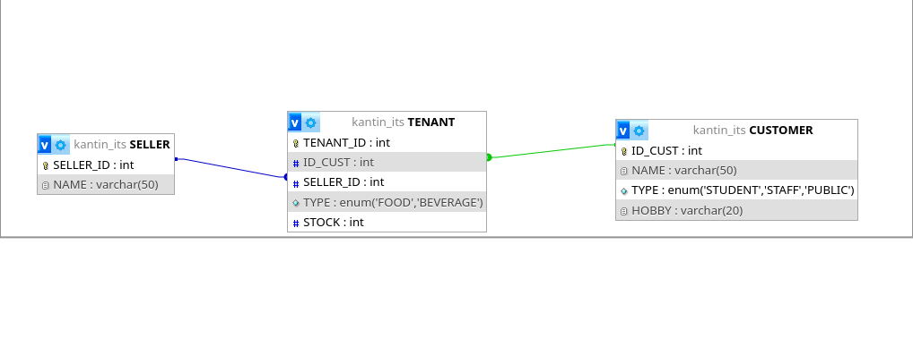
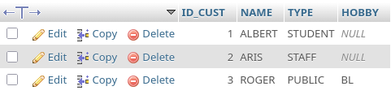

# DATABASE-KANTIN-ITS

**CATUR SETYO RAGIL 5027251066**

## ERD


---

1. Membuat Database
```SQL
CREATE DATABASE kantin_its;
```

2. Membuat Table Customer dan Seller
```SQL
CREATE TABLE CUSTOMER(
	ID_CUST INT NOT NULL AUTO_INCREMENT PRIMARY KEY,
	NAME VARCHAR(50) NOT NULL,
	TYPE ENUM('STUDENT', 'STAFF', 'PUBLIC') NOT NULL
);

CREATE TABLE SELLER(
	SELLER_ID INT NOT NULL AUTO_INCREMENT PRIMARY KEY,
	NAME VARCHAR(50) NOT NULL
);
```

3. Membuat Junction Table
```SQL
CREATE TABLE TENANT(
    TENANT_ID INT AUTO_INCREMENT NOT NULL PRIMARY KEY,
    ID_CUST INT NOT NULL,
    SELLER_ID INT NOT NULL,
    FOREIGN KEY (ID_CUST) REFERENCES CUSTOMER(ID_CUST),
    FOREIGN KEY (SELLER_ID) REFERENCES SELLER(SELLER_ID)
);
```

4. Alter Table
```SQL
ALTER TABLE TENANT ADD COLUMN(
	HOBBY VARCHAR(20)
	TYPE ENUM ('FOOD', 'BEVERAGE') DEFAULT 'FOOD',
	STOCK INT CHECK (STOCK >= 10)
);
```

5. Insert Table
```SQL
INSERT INTO CUSTOMER VALUES (3, 'ROGER', 'PUBLIC', 'BL');

INSERT INTO CUSTOMER (ID_CUST, NAME, TYPE) VALUES(1, 'ALBERT', 'STUDENT'), (2, 'ARIS', 'STAFF'); 
```

Sehingga, table memiliki content:


