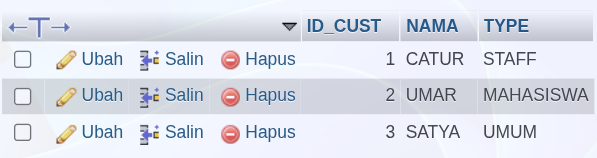

-- 1. Membuat Database
```sql
CREATE DATABASE KANTIN_ITS;
```

-- 2. Membuat Table Customer & Seller
```sql
CREATE TABLE CUSTOMER(
    ID_CUST INT(3) NOT NULL AUTO_INCREMENT PRIMARY KEY, 
    NAMA VARCHAR(20) NOT NULL,                          
    TYPE ENUM('MAHASISWA', 'STAFF', 'UMUM') NOT NULL    
);

CREATE TABLE SELLER(
    ID_SELL INT(11) NOT NULL AUTO_INCREMENT PRIMARY KEY
);
```

-- 3. Membuat Junction Table 
```sql
CREATE TABLE TENANT(
    ID_TENANT INT(11) NOT NULL AUTO_INCREMENT PRIMARY KEY,
    ID_CUST INT(3) NOT NULL,
    ID_SELL INT(11) NOT NULL,
    FOREIGN KEY (ID_CUST) REFERENCES CUSTOMER(ID_CUST),
    FOREIGN KEY (ID_SELL) REFERENCES SELLER(ID_SELL)
);
```

-- 4. Alter Table Tenant
```sql
ALTER TABLE TENANT 
ADD COLUMN TYPE ENUM ('FOOD', 'DRINK', 'SNACK') DEFAULT 'FOOD',
ADD COLUMN STOCK INT(11) CHECK (STOCK > 70);
```

-- 5. Insert Table
```sql
INSERT INTO CUSTOMER (NAMA, TYPE) VALUES ('CATUR', 'STAFF');
```
```sql
INSERT INTO CUSTOMER (ID_CUST, NAMA, TYPE) VALUES(002, 'UMAR', 'MAHASISWA'), (003, 'SATYA', 'UMUM'); 
```


